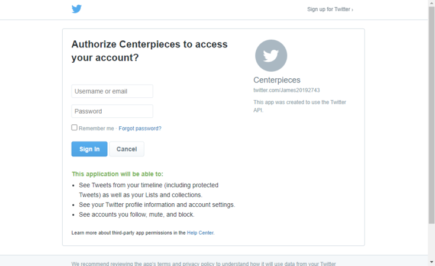

# Centerpiece
**Centerpiece** is an Electron app that combines my most frequented social media sites as well as information like articles from The NewYork Times and recent cryptocurrency data. These social media platforms and additional information are *central* to my everyday routine hence the name *Centerpiece*. 

- Cryptocurrency, Weather and News all accessible on the home page
- Fresh data loaded each time you run Centerpiece

  

## How it works

1. Click the social media tab or the colored buttons shown above the news articles

2. Sign into your Twitter and Twitch account
    - (Optional) Download and install [Chatterino](https://chatterino.com/), placing it here - (C:\Program Files\Chatterino\chatterino.exe)  
    *[see more down below](#chatterinoLink)*
    - Click *remember me* and forget about signing in again!
    
3. Browse your twitter feed or watch your favorite streamer!

  

## What I learned
- Javascript

- Integration testing
    - Wrote tests using Spectron and Mocha.
- Api Creation && Handling
    - Utilized Express.js to create a REST Api that interacted with my front end to deliver and update information.
- Electron
    - Created Electron app using electron-forge as a framework.
- OAuth
    - Used Passport.js to authenticate users and gain access to basic information such as twitter feeds.
- Fomantic.ui
    - Integrated fomantic styles that was used throughout the app, from the buttons to the containers.

## Credits
[Parse through tweets and create urls, username links and hashtag links](https://www.benmarshall.me/parse-twitter-hashtags/)
  by **Ben Marshall** (twitter.ejs - line 82)

##  Plugins and Presets
- Built using Electron **10.1.1**
- Weather section initially shows **Orlando**
- Cryptocurrency listed by **Market Cap** (shows top 100)
- Centerpiece looks for [Chatterino](https://chatterino.com/) if you have this extension installed and looks inside   this path - C:\Program Files\Chatterino\chatterino.exe
  - From [Chatterino's](https://chatterino.com/) Website - "Chatterino is a chat client for twitch chat. It aims to be an improved/extended version of the twitch web chat."

#### Completely remove access from Centerpiece

The *logout* tab redirects to the home page, deleting the session cookie but will continue to leave you signed in.  
To disconnect completely from your twitch account, click the link below and simply ***Disconnect*** from ***Centerpiece***:  
Twitch Disconnect: https://www.twitch.tv/settings/connections
 

To disconnect from twitter click the link below and click on the link below and select ***Centerpieces*** then **Revoke Access**  
Twitter Revoke Access: https://twitter.com/settings/connected_apps

